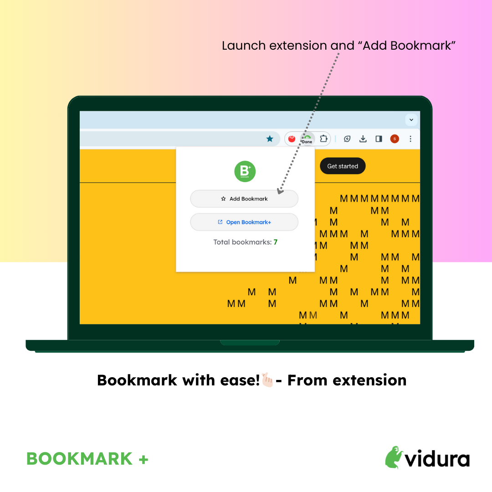

# Add a Bookmark via Bookmark Plus

After installing Bookamrk Plus, one can add a bookmark from Book Plus in two ways.

## 1. From extension

Navigate to chrome toolbar, select the `Extensions` -> `Bookmark Plus by Vidura`, and launch it. 

`Note`: For better user experience with the extension, please pin the extension to your chrome toolbar.

## 2. From context menu

Chrome browser context menu is the UI that appears when a mouse is "right-clicked". This shows multiple options and there you find the Bookmark Plus option too like in the below picture.

That's it. Bookmark categorization happens in the background with generative AI. You will see a small "Done" badge once the bookmark is successfully added.
