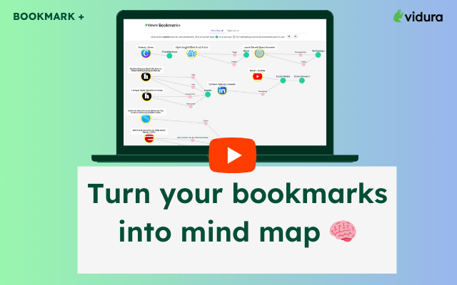
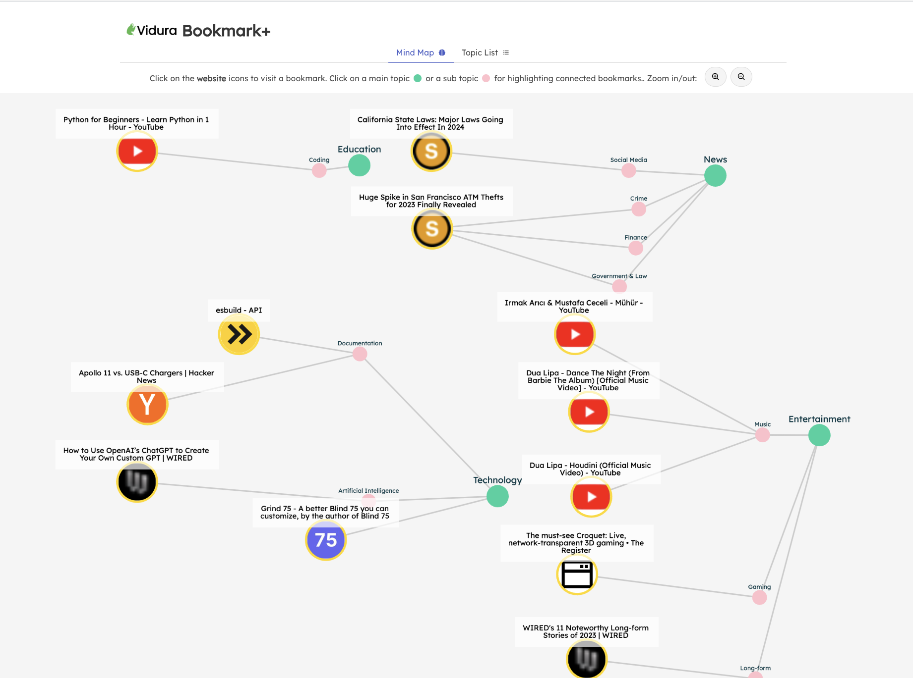
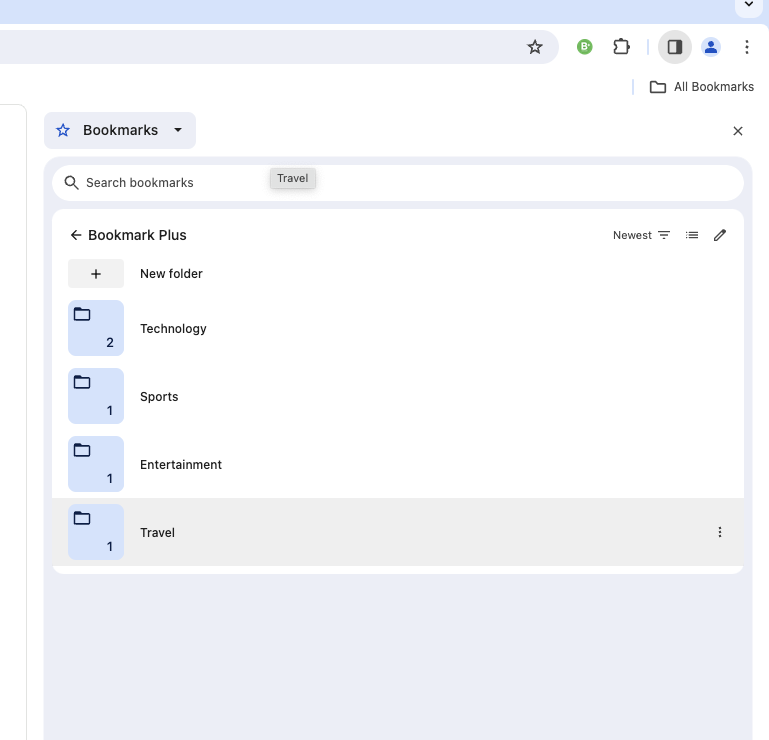
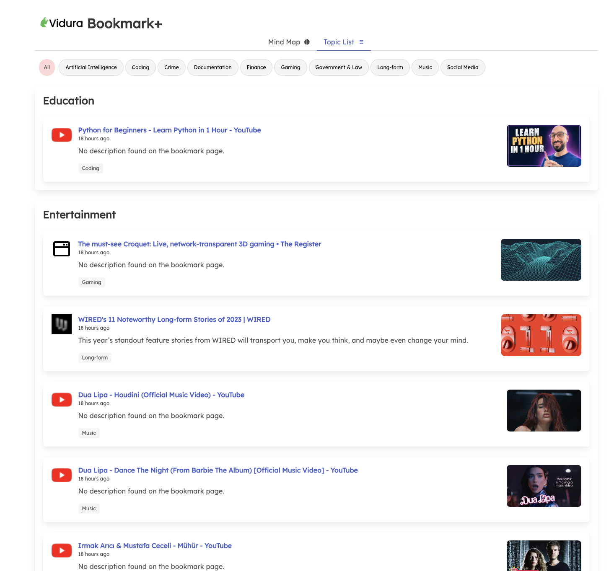

# Welcome 

Welcome to Bookmark Plus Chrome Extension Documentation.

 
Bookmark Plus (a.k.a Bookmark+) is a chrome extension that elevates bookmarking experience by automatically categorizing bookmarks into accurate topics using generative AI. This knowledge is transformed into a powerful mind map 🧠 for accessing bird's eye view of user's bookmarks.
 
 
**Important**: Before installing our chrome extension, we strongly recommend you to go through our [Terms & Conditions](./compliance/tnc.md) and [Privacy Policy](./compliance/ppolicy.md). 

Bookmark Plus is sponsored by Vidura Labs ([https://vidura.ai](https://vidura.ai))

Click to watch our global intro on YouTube:

## Main Features of Bookmark Plus

### Mind Map: See how bookmarks are connected
Once the Bookamrk Plus extension is installed, a user can start saving bookmarks from extension. And it generates a knowledge graph which powers the mind map.

Bookmark Plus provides a mind map like below in your browser. This view provides an overall view to quickly navigate to given bookmark and also shows how bookmarks are connected. Just click on the logo of website, and you will be taken to the bookmark.

### Auto-categorization of bookmarks
In addition to knowledge graph, Bookmark Plus adds a system bookmark by creating a topic folder. All these new bookmarks are stored in `Bookmark Plus` bookmarks folder in the browser.

### Topic List: Polished & enriched bookmarks
The standard bookmarks do not reveal additional context like sub-topic, thumbnails to quickly re-collect context of bookmarked websites. Bookmark Plus topic list solves this problem by enriching bookmarked website.

